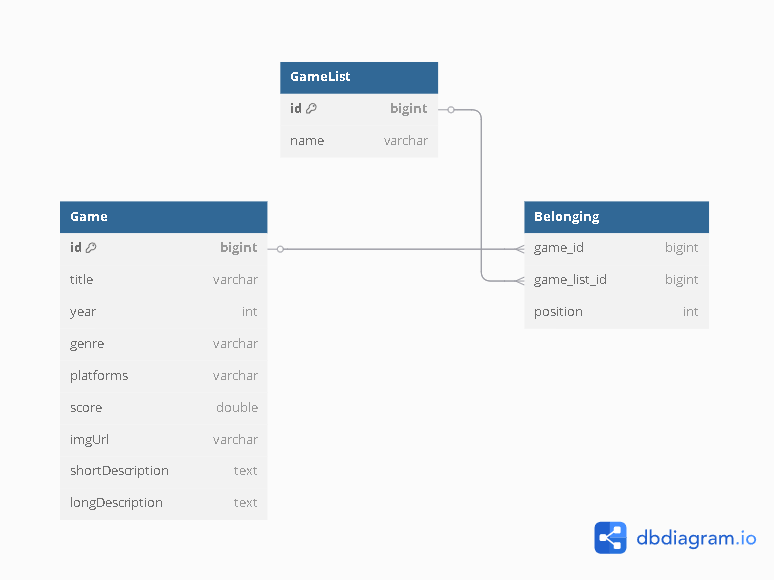

# 🎮 DSLIST

API RESTful para gerenciamento de listas de jogos, construída com Java e Spring Boot.


---

## 📌 Descrição

O **DSLIST** é um projeto backend desenvolvido com o objetivo de explorar a construção de APIs RESTful utilizando Java com Spring Boot. Ele permite o gerenciamento de jogos e listas personalizadas de jogos, com funcionalidades como reordenação, filtros, e operações CRUD completas.

---

## 🧪 Tecnologias Utilizadas

- ✅ Java 17  
- ✅ Spring Boot  
- ✅ Spring Data JPA  
- ✅ Hibernate  
- ✅ H2 Database (memória)  
- ✅ Maven

---

## 📁 Estrutura do Projeto

```
src/
└── main/
    └── java/
        └── com.devsuperior.dslist/
            ├── controllers/
            ├── dto/
            ├── entities/
            ├── exceptions/
            ├── projections/
            ├── repositories/
            ├── services/
            └── DslistApplication.java
```

---

## 🔧 Funcionalidades

- 🔹 Listar todos os Games
- 🔹 Buscar Games por **ID**
- 🔹 Buscar Games por **parte do nome**
- 🔹 Buscar Games por **score**
- 🔹 Criar um novo Game
- 🔹 Criar uma nova GameList
- 🔹 Listar todas as GameList
- 🔹 Atualizar nome de uma GameList
- 🔹 Deletar uma Gamelist
- 🔹 Reordenar jogos dentro de uma lista
- 🔹 Listar GameList em **ordem decrescente**

---

## 🧩 Modelo de Dados (ERD)

> Relação entre `Game`, `GameList` e `Belonging`



---

## 🚀 Como Executar

### Pré-requisitos

- Java 17+
- Maven

### Passos

```bash
# Clone o repositório
git clone https://github.com/seu-usuario/dslist.git

# Acesse a pasta do projeto
cd dslist

# Rode a aplicação
./mvnw spring-boot:run
```

Acesse no navegador:  
👉 http://localhost:8080

---

## 🛠 Acesso ao H2 Console

- URL: `http://localhost:8080/h2-console`
- JDBC URL: `jdbc:h2:mem:testdb`
- User: `sa`
- Password: *(em branco)*

---

## 📬 Rotas principais

| Método | Endpoint                     | Descrição                                  |
|--------|------------------------------|--------------------------------------------|
| GET    | `/games`                     | Lista todos os games                       |
| GET    | `/games/{gameId}`            | Retorna Game por ID                        |
| GET    | `/games/search/{title}`      | Filtra Games por nome                      |
| GET    | `/games/score/{score}`       | Filtra Games por score                     |
| POST   | `/games`                     | Cria um novo Game                          |
| PUT    | `/games/{gameId}`            | Atualiza nome do Game                      |
| DELETE | `/games/{gameId}`            | Remove um Game                             |
| GET    | `/lists`                     | Lista todos os GameList                    |
| GET    | `/lists/{gameListId}`        | Retorna GameList por ID                    |
| GET    | `/lists/orderDesc`           | Lista todos os Gamelist decrescentemente  |
| GET    | `/lists/{listId}/games`      | Lista todos os Games de uma GameList       |
| POST   | `/lists`                     | Cria uma nova GameList                     |
| PUT    | `/lists/{gameListId}`        | Atualiza nome da GameList                  |
| DELETE | `/lists/{gameListId}`        | Remove uma GameList                        |
| POST   | `/lists/{listId}/replacement`| Reordena posição de um Game na lista       |

---

## ⚠️ Tratamento de Erros

- `404` - Game ou Lista não encontrada
- `400` - Parâmetros inválidos
- `422` - Score fora do intervalo permitido
- Handler centralizado: `GlobalExceptionHandler`

---

## 👨‍💻 Autor

Feito por [Caio Magalhães]  
Entre em contato: https://www.linkedin.com/in/devfcaio/

---
